# z2g — One-Way Zoho Calendar → Google Calendar Sync

Mirrors Zoho Calendar events to a Google Calendar. One-way only (Zoho → Google). No attendees: mirrored events block time and show reminders, but does not expose your Gmail address or invite RSVPs.

Useful when you receive calendar invites in Zoho via email aliases and want them to block your Google Calendar with notifications, without adding yourself as an attendee.

## Features

- One-way sync: Zoho → Google (never writes back to Zoho)
- No attendees: events are informational blocks, no RSVP workflow
- All-day and timed events supported
- Optional: delete from Google when events are removed/cancelled in Zoho
- Headless-friendly auth: `--manual` for SSH, Docker, or no local server

**Not for you if:** you need two-way sync, full attendee/RSVP handling, or multiple Zoho→Google calendar pairs in one process. z2g is intentionally one-way, one-calendar-pair, and “block time + reminders only.”

## Requirements

- Python 3.11+
- [uv](https://docs.astral.sh/uv/) (recommended) or pip
- GCP project with Calendar API enabled
- Zoho developer app with Calendar scope

## Quick Start

```bash
# Install
cd zoho2gcal && uv sync

# One-time setup (see below)
# Then sync (one-off) or run (scheduled + optional alerts)
uv run z2g sync --since=-7d --until=+90d
```

### Quick start (Docker)

No local Python or uv: use Docker only. Create a data directory, mount it, and run one-off commands to complete setup (Zoho exchange code, list calendars, Google auth `--manual`). Run the container once to verify auth/scopes; set `ZOHO_CALENDAR_UID` and `GOOGLE_CALENDAR_ID` before enabling cron (sync/run require them). See [Docker](#docker) for the full flow.

```bash
docker pull ghcr.io/mathematicalmaker/zoho2gcal:latest
mkdir -p data && docker run --rm -v "$(pwd)/data:/data" ghcr.io/mathematicalmaker/zoho2gcal:latest   # bootstraps .env + secrets if missing; runs verify
```

## Setup

If you don’t have [uv](https://docs.astral.sh/uv/) yet, install it from the [Astral getting started / installation](https://docs.astral.sh/uv/getting-started/installation/) page.

Before starting: copy `.env.example` → `.env` and fill in credentials.

### 1. Zoho (API Console + OAuth)

1. Go to [Zoho API Console](https://api-console.zoho.com/) and click **GET STARTED** (or sign in).
2. Choose **Self Client** → **CREATE NOW**. (Self Client uses the Generate Code flow below; no redirect URI needed.)

   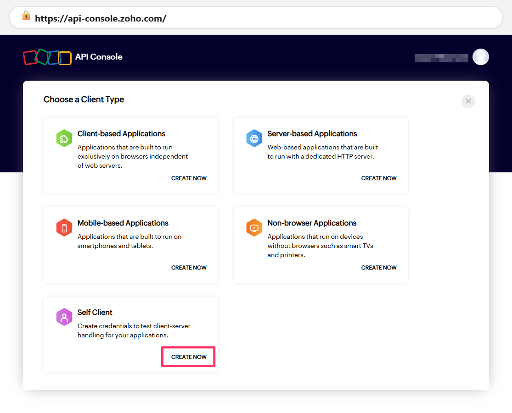

3. Open the **Client Secret** tab and copy **Client ID** and **Client Secret** into `.env` as `ZOHO_CLIENT_ID` and `ZOHO_CLIENT_SECRET`.

   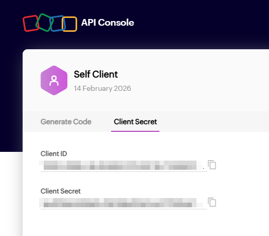

4. Open the **Generate Code** tab. Set **Scope** to `ZohoCalendar.calendar.READ,ZohoCalendar.event.READ` (comma-separated, no spaces). Set **Code expiry duration** (e.g. 10 minutes). Optionally add a **Description** (e.g. `z2g`). Click **CREATE**.

   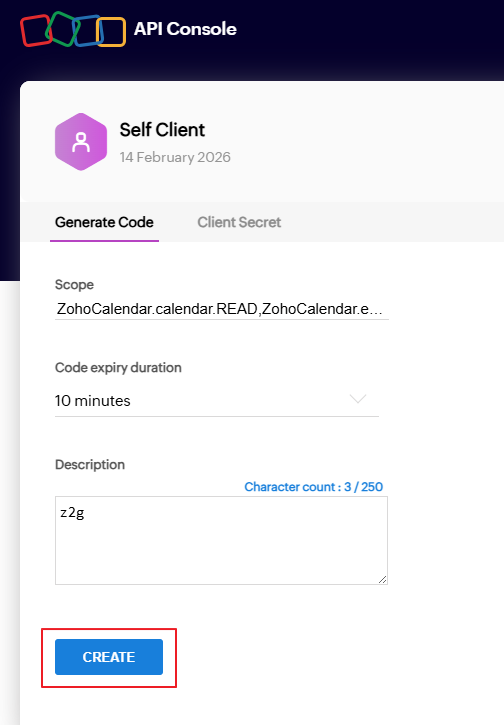

5. In the "Generated Code" dialog, click **COPY** to copy the authorization code. (You can use **DOWNLOAD** to save a JSON with the code and scope; useful to confirm scope but not required.)

   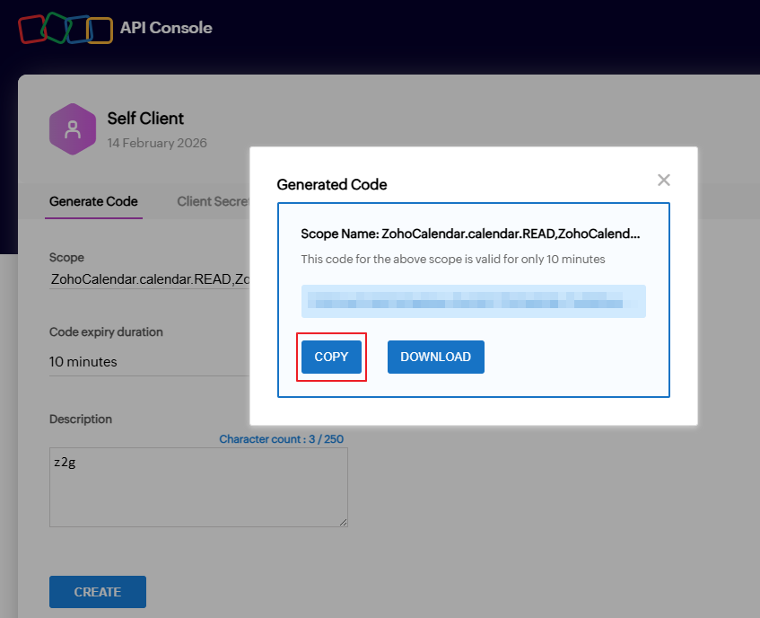

6. Run:

```bash
uv run z2g zoho-exchange-code --code YOUR_COPIED_CODE
```

   Add the printed `ZOHO_REFRESH_TOKEN=...` line to `.env`.

7. Verify: `uv run z2g list-zoho-calendars`. Note the calendar UID you want to sync and set `ZOHO_CALENDAR_UID` in `.env`.

If the exchange fails with a `redirect_uri` error, try `--redirect-uri urn:ietf:wg:oauth:2.0:oob` (or the value shown for your Self Client).

### 2. Google Cloud (GCP)

1. Go to [Google Cloud Console](https://console.cloud.google.com/). You may need to agree to terms of service if this is your first project.
2. Click **Select a project** → **New project**. Name it (e.g. `zoho2gcal`), choose parent if needed, click **Create**.

   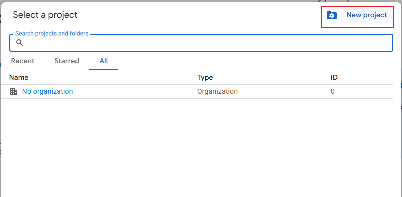  
   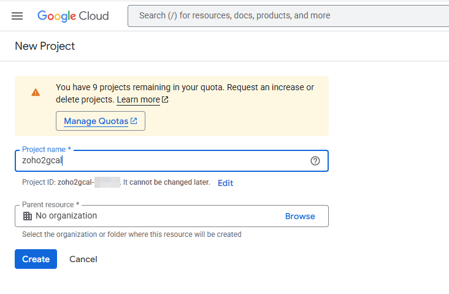

3. Enable the **Google Calendar API**: APIs & Services → **Library** → search "Google Calendar API" → **Enable**.

   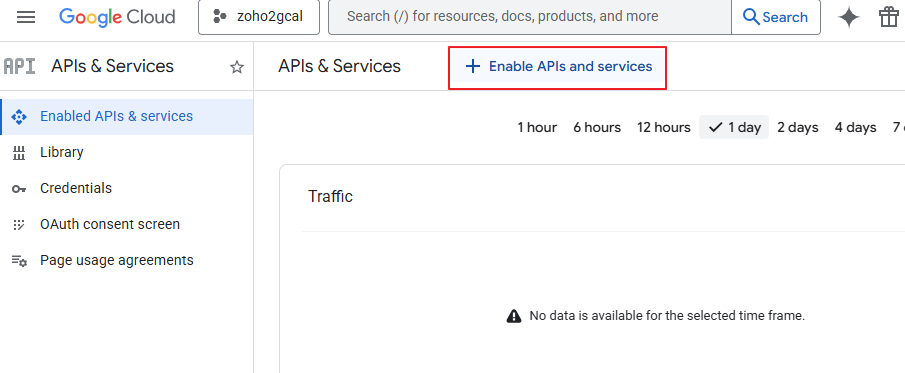  
   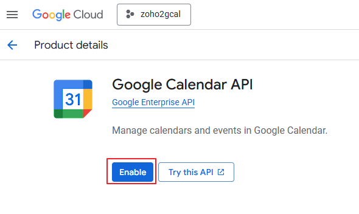

4. Configure the **OAuth consent screen**: APIs & Services → **OAuth consent screen**.

   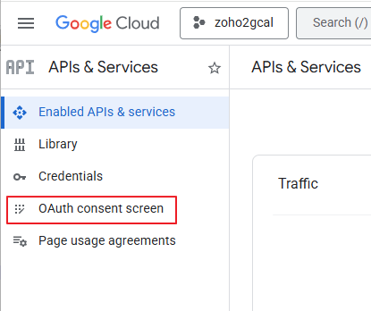

   - **Project configuration / App Information**: Enter app name (e.g. `zoho2gcal`) and your email for User support email. Click **Next**. Skip branding (optional). On the final step, enter contact info if prompted, agree to terms, click **Create**.

   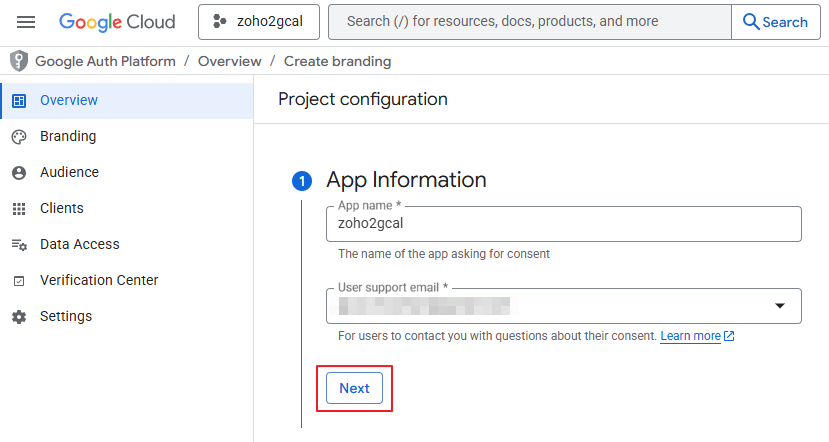  
   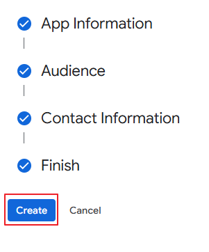

   - **Audience**: Choose **External** → **Next**. Then add yourself as a test user (**+ Add users**), then **Publish app** and confirm. (Switch to **Production** later so refresh tokens stay valid; in Testing they expire after 7 days of inactivity.)

     
   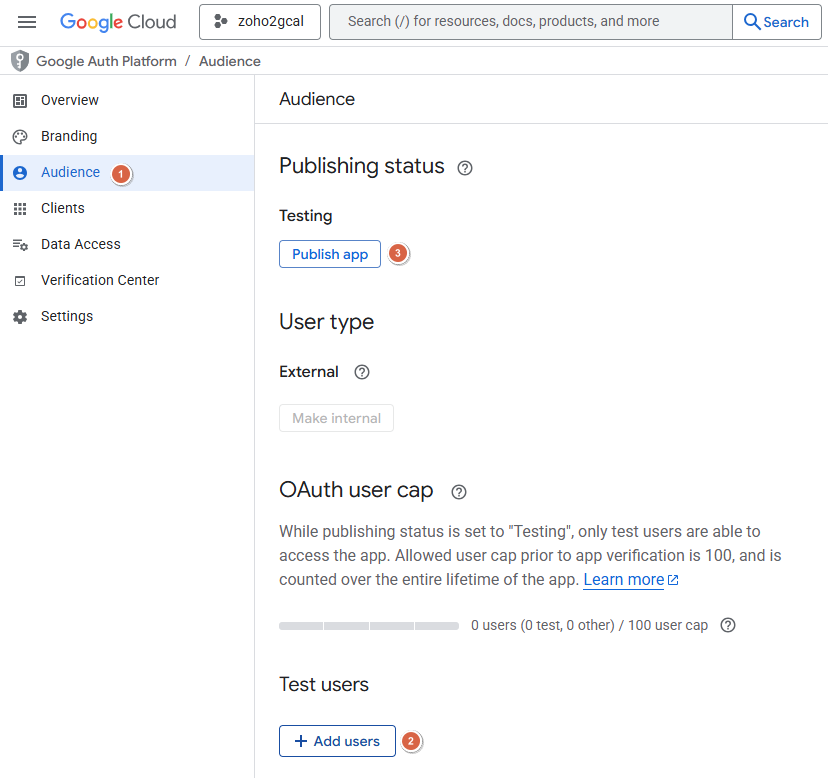

5. Add scopes: **Data Access** → **Add or remove scopes**. Select:
   - `https://www.googleapis.com/auth/calendar.events` — view and edit events
   - `https://www.googleapis.com/auth/calendar.calendarlist.readonly` — see the list of calendars (for `list-google-calendars` and `GOOGLE_CALENDAR_ID`)

   Click **Update**.

   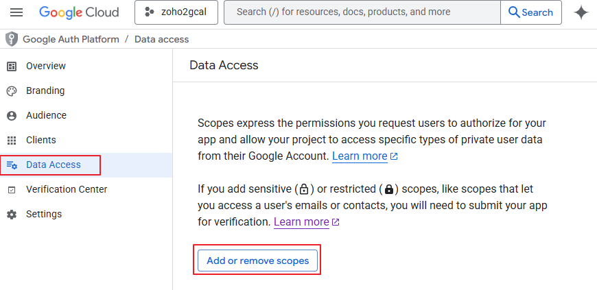  
   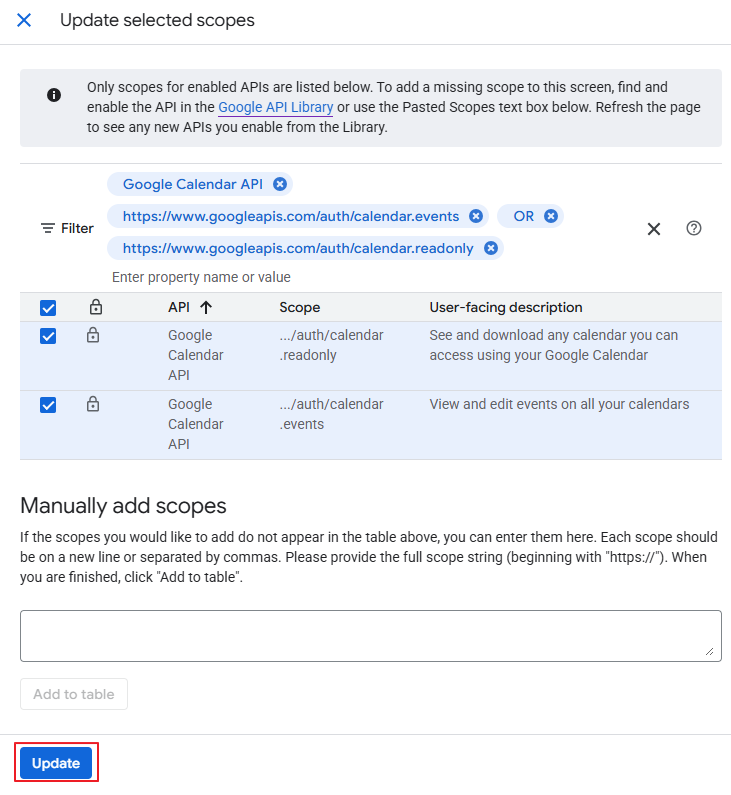

6. Create **OAuth client ID**: **Clients** → **Create client** → Application type: **Desktop app** → Name (e.g. `z2g-cli`) → **Create**.

   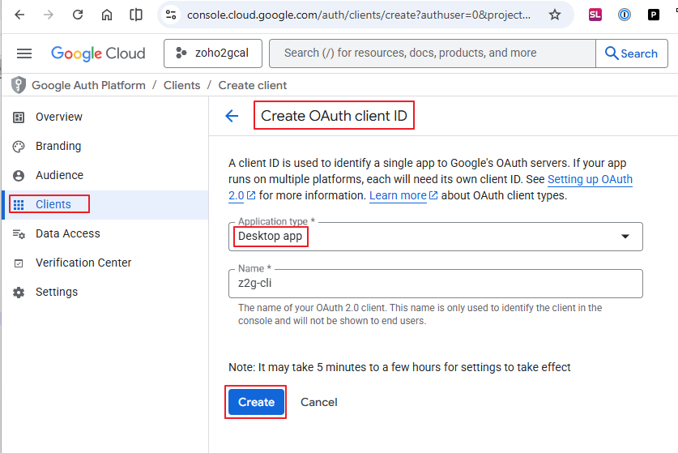

7. In the "OAuth client created" dialog, click **Download JSON**. Save as `secrets/google_client_secret.json`. (Optionally copy Client ID and Client secret to a secure place before closing.)

   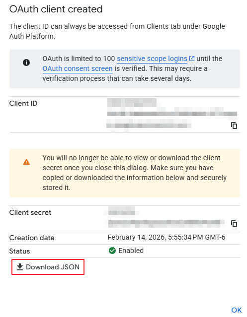

### 3. Environment and Secrets

Edit `.env` as you complete the steps above and below:
   - `ZOHO_CLIENT_ID`, `ZOHO_CLIENT_SECRET`, `ZOHO_REFRESH_TOKEN`, `ZOHO_CALENDAR_UID` (from Zoho step 7)
   - `GOOGLE_CALENDAR_ID` (from Google step 4)

### 4. Google OAuth (One-Time)

```bash
# Local server (opens callback on localhost)
uv run z2g google-auth

# Or manual: print URL, paste redirect back (for SSH, Docker, headless)
uv run z2g google-auth --manual
```

With `--manual`, the tool prints a URL. Open it in a browser. If you see "Google hasn't verified this app", click **Go to [your app] (unsafe)** — verification is not required for your own app in Testing. On the consent screen, select the requested permissions and click **Continue**. If you see "This site can't be reached" after authorizing, that's OK — copy the full URL from the address bar and paste it into your terminal when prompted.

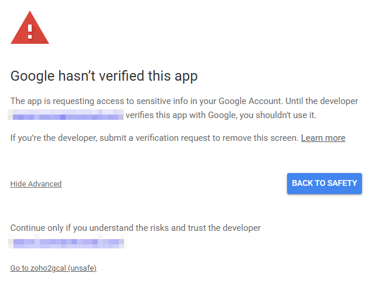  
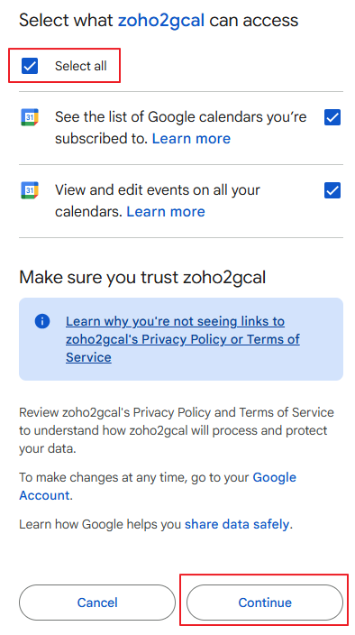

Token is written to `secrets/google_token.json`. The refresh token inside is long-lived (GCP must be in Production). Validate with:

```bash
uv run z2g list-google-calendars
```

Note the calendar ID you want to sync and set `GOOGLE_CALENDAR_ID` in `.env`.

## Usage

```bash
# One-off sync (interactive/debug; no state or alerts)
uv run z2g sync
uv run z2g sync --since=-7d --until=+90d

# Scheduled runs (updates state file; can alert via webhook on repeated failures)
uv run z2g run
uv run z2g run --since=-7d --until=+90d

# Custom range
uv run z2g sync --since=2026-02-01 --until=2026-03-15
uv run z2g sync --since=-7d --until=+90d

# Dry-run (no writes, shows inserts/patches/skips/deletes)
uv run z2g sync --dry-run

# Delete from Google events no longer in Zoho
uv run z2g sync --delete-missing
```

**sync** vs **run**:
- **`sync`** — One-off sync. No state file, no alerting. Use for interactive runs, debugging, or ad-hoc syncs.
- **`run`** — Scheduled entry point. Writes a state file (e.g. `.z2g-alert-state.json`) and, when `Z2G_ALERT_WEBHOOK_URL` is set, can POST to that URL after repeated failures (see [Alerting](#alerting)).

### Time Range

- `--since`, `--until`: date (YYYY-MM-DD), ISO datetime, or relative (`+7d`, `-12h`, `+30m`).
- Relative negatives: use `--since=-7d` (equals sign required).
- Defaults: `SYNC_LOOKBACK_DAYS`, `SYNC_LOOKAHEAD_DAYS` from `.env`.

### Commands

| Command | Description |
|---------|-------------|
| `sync` | One-off sync Zoho → Google (no state or alerting) |
| `run` | Scheduled sync: same as sync but updates state and can alert via webhook |
| `zoho-events` | List Zoho events (debug) |
| `google-auth` | Run Google OAuth flow (write token JSON) |
| `zoho-exchange-code` | Exchange Zoho auth code → refresh token |
| `list-zoho-calendars` | Show Zoho calendar UIDs |
| `list-google-calendars` | Show Google calendar IDs, names, and default reminders (GOOGLE_REMINDERS-style, tab-separated)^1^ |
| `verify` | Check auth and Zoho + Google connections/scopes (sync/run also require calendar IDs) |
| `zoho-token` | Print Zoho access token (debug) |

^1^ Formats well with:
	 `z2g list-google-calendars | sed 's/\t/ /g'` or
	 `z2g list-google-calendars | awk -F'\t' 'NR>1 {print $3}'`

## Environment Variables

| Variable | Required | Description |
|----------|----------|-------------|
| `ZOHO_CLIENT_ID` | Yes | From Zoho API Console |
| `ZOHO_CLIENT_SECRET` | Yes | From Zoho API Console |
| `ZOHO_REFRESH_TOKEN` | Yes | From `z2g zoho-exchange-code` |
| `ZOHO_CALENDAR_UID` | Yes | From `z2g list-zoho-calendars` |
| `ZOHO_ACCOUNTS_HOST` | No | Default `https://accounts.zoho.com` |
| `GOOGLE_CALENDAR_ID` | Yes | From `z2g list-google-calendars` |
| `GOOGLE_CLIENT_SECRET_JSON` | Yes | Path to client secret JSON |
| `GOOGLE_TOKEN_JSON` | Yes | Path to token output (e.g. `./secrets/google_token.json`) |
| `SYNC_LOOKBACK_DAYS` | No | Default 7 |
| `SYNC_LOOKAHEAD_DAYS` | No | Default 90 |
| `TITLE_MODE` | No | `busy` or `original` |
| `ICALUID_SUFFIX` | No | Suffix for mirrored event UIDs |
| `GOOGLE_REMINDERS` | No | Override reminders, e.g. `popup:10,email:30` |
| `Z2G_DELETE_MISSING` | No | Set to `1` to enable delete-missing behavior |
| `Z2G_VERBOSE` | No | Set to `1` for verbose logs |
| `DATA_DIR` / `Z2G_DATA_DIR` | No | Project root for `.env` and `secrets/`; defaults to `/data` (only set if your Docker mount path differs) |
| `SYNC_SINCE` / `SYNC_UNTIL` | No | Explicit range (e.g. `-7d`, `+90d`); overrides `SYNC_LOOKBACK_DAYS` / `SYNC_LOOKAHEAD_DAYS` when set |
| `Z2G_GOOGLE_AUTH_MANUAL` | No | Set to `1` to use manual (paste URL) Google auth |
| `Z2G_CRON_ENABLED` | No | Set to `1` in Docker to start supercronic (scheduled syncs); default runs `verify` and exits |
| `Z2G_SHELL` | No | Set to `1` in Docker to drop into bash and keep container running (for `docker exec`, setup, debugging) |

All sync/run options except `--dry-run` can be set via env for Docker/supercronic.

### Alerting (optional, for `run`)

When **`run`** is used and sync fails repeatedly, z2g can POST a JSON payload to a webhook URL. On the first successful run after a failure, z2g sends an all-clear payload to the **same** URL. One webhook URL is used for both; the payload’s `event` field (`z2g_alert` or `z2g_all_clear`) distinguishes them. Useful for cron/supercronic/Docker so you get notified (e.g. [Pushover webhook](#pushover-webhook), [Home Assistant](#home-assistant), IFTTT, or Zapier) instead of silent failures.

| Variable | Default | Description |
|----------|---------|-------------|
| `Z2G_ALERT_WEBHOOK_URL` | — | If set, POST failure and all-clear payloads to this URL |
| `Z2G_ALERT_STATE_FILE` | `.z2g-alert-state.json` (under project root) | Path to state file for last run and failure count |
| `Z2G_ALERT_MIN_FAILURES` | `2` | Send failure alert only after this many consecutive failures |
| `Z2G_ALERT_RATE_HOURS` | `24` | Do not send another failure alert within this many hours of the last one. All-clear resets this so the next failure will alert. |
| `Z2G_ALERT_HOURS_START` | — | Only send failure alerts when local time is in this window. Examples: 10 and 22 = 10am–10pm; 22 and 2 = 10pm–2am (overnight). |
| `Z2G_ALERT_HOURS_END` | — | End of window (see START). Use 24 for midnight. |
| `Z2G_ALERT_TIMEZONE` | `UTC` | Timezone for the alert window (e.g. `America/Chicago`) |

**Webhook payload format** (JSON, `Content-Type: application/json`):

**Failure** (`event`: `"z2g_alert"`):

| Field | Type | Description |
|-------|------|-------------|
| `event` | string | `"z2g_alert"` |
| `consecutive_failures` | int | Number of consecutive failed runs |
| `last_error` | string \| null | Message of the last exception |
| `last_run` | string | ISO datetime of the last run |
| `message` | string | Human-readable one-line summary |

**All-clear** (`event`: `"z2g_all_clear"`) — sent on first success after failure; clears the failure-alert rate limit so the next failure will trigger an alert:

| Field | Type | Description |
|-------|------|-------------|
| `event` | string | `"z2g_all_clear"` |
| `last_run` | string | ISO datetime of the run |
| `message` | string | e.g. `z2g run succeeded after previous failure(s).` |

Example failure payload:

```json
{
  "event": "z2g_alert",
  "consecutive_failures": 2,
  "last_error": "Missing env var: ZOHO_CLIENT_ID",
  "last_run": "2026-02-13T14:30:00+00:00",
  "message": "z2g run failed 2 time(s): Missing env var: ZOHO_CLIENT_ID"
}
```

Example all-clear payload:

```json
{
  "event": "z2g_all_clear",
  "last_run": "2026-02-13T15:00:00+00:00",
  "message": "z2g run succeeded after previous failure(s)."
}
```

#### Pushover webhook

Easiest option: no app registration in z2g, just one URL. [Pushover supports webhooks](https://blog.pushover.net/posts/2026/2/webhooks)—create a webhook at [pushover.net/webhooks/build](https://pushover.net/webhooks/build) (or dashboard → **Your Webhooks** → **Create a Webhook**), then POST JSON to its URL; Pushover turns it into a notification.

1. Create a webhook, name it (e.g. `z2g-alert`), and copy the webhook URL. You need at least one [Pushover application](https://pushover.net/apps/build) to use as the sender.
2. Set in your env: `Z2G_ALERT_WEBHOOK_URL=<your Pushover webhook URL>`
3. In the webhook’s **Data Extraction** (or after the first alert, use **Last Payload** and **Test Selectors on Last Payload** to try values):
   - **Title** (selector): `{{event}}` or static text (e.g. `z2g alert`)
   - **Body** (selector): **required** — you can use a single field or combine fields with static text. Pushover does not document whether `\n` in the selector is rendered as a newline; if you see literal `\n`, use a single-line body instead.
   - **URL** / **URL title** / **Image**: optional; z2g does not send these, but you can use static values or leave blank.

   **Body examples:**
   - One-line: `{{message}}`
   - Combined (try `\n` for newlines; if it shows literally, use the one-line or a separator like ` — `):  
     `{{message}}\n\nError: {{last_error}}\nFailures: {{consecutive_failures}}\nAt: {{last_run}}`
4. Save. When **`run`** fails repeatedly and conditions are met, z2g POSTs the payload to that URL and you get a Pushover notification.

z2g sends failure (`event`: `z2g_alert`) and all-clear (`event`: `z2g_all_clear`) payloads. For all-clear, only `event`, `last_run`, and `message` are present. Top-level keys for selectors:

| z2g payload key | Type | Example selector | Description |
|------------------|------|------------------|-------------|
| `event` | string | `{{event}}` | `"z2g_alert"` or `"z2g_all_clear"` |
| `message` | string | `{{message}}` | Human-readable summary (use for Body) |
| `last_error` | string \| null | `{{last_error}}` | Exception message (failure only) |
| `consecutive_failures` | int | `{{consecutive_failures}}` | Failure count (failure only) |
| `last_run` | string | `{{last_run}}` | ISO datetime of last run |

#### Home Assistant

Use an inbound webhook and automation if you want to drive **automations** (e.g. flashing LED, custom notification logic, or routing to Pushover/other targets from HA).

1. In Home Assistant, create an **Inbound Webhook** (Settings → Automations & Scenes → Webhooks → Add Webhook). Copy the webhook URL (e.g. `https://your-ha.example.com/api/webhook/z2g-alert`).
2. Set in your env: `Z2G_ALERT_WEBHOOK_URL=https://your-ha.example.com/api/webhook/z2g-alert`
3. Create an automation that triggers on this webhook. **Action:** e.g. call `notify.pushover` with `{{ trigger.json.message }}`, or trigger a script (flashing LED, etc.).

**Trigger:** Webhook, same ID as in the URL (e.g. `z2g-alert`).  
**Action example:** `notify.pushover` with title `Z2g sync failed`, message `{{ trigger.json.message }}`.

4. Schedule **`run`** (e.g. cron or HA shell command); when sync fails repeatedly, the webhook fires and your automation runs.

#### IFTTT

1. Create an IFTTT Applet: **If Webhooks** (Receive a web request) **Then** your desired action (e.g. send a notification, email, or push).
2. In Webhooks, create a webhook and note the URL (e.g. `https://maker.ifttt.com/trigger/z2g_alert/with/key/YOUR_KEY`).
3. Set `Z2G_ALERT_WEBHOOK_URL` to that URL. IFTTT’s “Receive a web request” can accept JSON in the body; you can pass through `value1`/`value2`/`value3` if you use the IFTTT webhook format (e.g. `value1={{message}}`). For a simple “notify me” applet, the default z2g JSON body may still trigger the applet; for custom values you’d need an intermediary (e.g. HA or a small script) to map z2g’s payload to IFTTT’s expected format.
4. Schedule **`run`**; on repeated failures the webhook fires and IFTTT runs your action.

#### Zapier

1. Create a Zap: **Trigger** = Webhooks by Zapier → **Catch Hook** (or **Custom Request**). Copy the webhook URL.
2. Set `Z2G_ALERT_WEBHOOK_URL` to that URL.
3. In Zapier, map the incoming JSON fields (`event`, `message`, `last_error`, `consecutive_failures`, `last_run`) to whatever action you want (e.g. email, Slack, Pushover via a Zapier action).
4. Schedule **`run`**; on repeated failures the webhook fires and the Zap runs.

### Exit codes

| Code | Meaning |
|------|---------|
| 0 | Success |
| 1 | Error (e.g. API failure, missing config) |
| 2 | Usage error (unknown command or invalid args) |
| 130 | Interrupted (Ctrl+C) |

## Scheduling

Use **`run`** (not `sync`) when scheduling, so state and optional webhook alerting work:

```bash
# Crontab (every 15 minutes)
*/15 * * * * cd /path/to/zoho2gcal && uv run z2g run
```

Or use **`run`** in Docker, supercronic, systemd, or Windows Task Scheduler. Set `Z2G_ALERT_WEBHOOK_URL` (and optionally other `Z2G_ALERT_*` vars) to get notified on repeated failures.

## Docker

You can run z2g entirely in Docker (no local uv/Linux/WSL). The image uses **supercronic** for scheduled syncs; by default the container runs **`z2g verify`** and exits so you don’t start cron before setup is done.

### Build and data directory

Use the image from [GitHub Container Registry](https://github.com/mathematicalmaker/zoho2gcal/pkgs/container/zoho2gcal) (no build required):

```bash
docker pull ghcr.io/mathematicalmaker/zoho2gcal:latest
```

Or build from source:

```bash
docker build -t zoho2gcal .
```

In the examples below, `zoho2gcal` is the image name. If you pulled from GHCR, use `ghcr.io/mathematicalmaker/zoho2gcal:latest` instead (or run `docker tag ghcr.io/mathematicalmaker/zoho2gcal:latest zoho2gcal` once).

Create a data directory and mount it as `/data`. The container **bootstraps** on startup: if `.env` doesn’t exist, it is created from the built-in example (your config is never overwritten). Reference files—`README.md`, `.env.example`, `secrets/README.md`, and `crontab.example`—are **updated from the image on every start**, so pulling a new image gives you current docs and env templates.

If you prefer to prepare manually (e.g. when developing locally):

```bash
mkdir -p data data/secrets
cp .env.example data/.env
```

Mount the directory as `/data` so z2g finds `.env` and `secrets/` (defaults to `/data`; set `DATA_DIR` only if your mount path differs). Docker-only env vars (`Z2G_SHELL`, `Z2G_CRON_ENABLED`, `DATA_DIR`) are set when you create the container—in **Portainer** use the **Env** tab; on the CLI use `-e VAR=value`.

### Default: verify and exit

With no arguments and **no** `Z2G_CRON_ENABLED`, the container runs `z2g verify` (checks auth + Zoho/Google connections and scopes) and exits:

```bash
docker run --rm -v "$(pwd)/data:/data" zoho2gcal
```

Verify does **not** require `ZOHO_CALENDAR_UID` or `GOOGLE_CALENDAR_ID` (so you can run it after getting tokens but before picking calendars). Sync/run **do** require them, so set both before enabling cron or sync will fail. Fix any missing env or connection errors before enabling cron.

### One-off commands (Docker-only setup)

Run any z2g command by passing it after the image name. Use these to complete setup without uv on the host:

1. **Zoho:** Put `ZOHO_CLIENT_ID` and `ZOHO_CLIENT_SECRET` in `data/.env` (from Zoho API Console → Self Client → Client Secret tab). Download the Google client secret JSON from GCP and save as `data/secrets/google_client_secret.json`. Ensure `data/.env` has `GOOGLE_CLIENT_SECRET_JSON=./secrets/google_client_secret.json` and `GOOGLE_TOKEN_JSON=./secrets/google_token.json`.

2. **Zoho refresh token:** Generate a code in Zoho (Generate Code tab), then:
   ```bash
   docker run --rm -v "$(pwd)/data:/data" zoho2gcal zoho-exchange-code --code YOUR_CODE
   ```
   Add the printed `ZOHO_REFRESH_TOKEN=...` line to `data/.env`.

3. **Zoho calendar UID:**
   ```bash
   docker run --rm -v "$(pwd)/data:/data" zoho2gcal list-zoho-calendars
   ```
   Set `ZOHO_CALENDAR_UID` in `data/.env`.

4. **Google token:** Use **`--manual`** in Docker (no local callback server). Run with **`-it`** so you can paste the redirect URL:
   ```bash
   docker run -it --rm -v "$(pwd)/data:/data" zoho2gcal google-auth --manual
   ```
   Open the printed URL in a browser, authorize, then copy the full URL from the address bar (even if the page says "can’t be reached") and paste it into the terminal.

5. **Google calendar ID:**
   ```bash
   docker run --rm -v "$(pwd)/data:/data" zoho2gcal list-google-calendars
   ```
   Set `GOOGLE_CALENDAR_ID` in `data/.env`.

6. **Verify:** Run again with no args; you should see "Config OK. Zoho and Google connections and scopes verified."

### Enable scheduled syncs (supercronic)

When config is OK, start the container with **`Z2G_CRON_ENABLED=1`**. The entrypoint creates `data/crontab` from an example (run every 15 minutes) if it doesn’t exist; you can edit `data/crontab` to change the schedule:

```bash
docker run -d \
  --name z2g \
  -v "$(pwd)/data:/data" \
  -e Z2G_CRON_ENABLED=1 \
  zoho2gcal
```

To disable cron again, stop the container and run without `Z2G_CRON_ENABLED=1` (or remove it); the default is verify-and-exit. You can also edit `data/crontab` and comment out the line to pause syncs without changing env.

### Shell into the container

The container exits after `verify` by default, so `docker exec` won’t work until it’s running. Start it with **`Z2G_SHELL=1`** to drop into bash and keep it running:

```bash
docker run -d --name z2g -v "$(pwd)/data:/data" -e Z2G_SHELL=1 zoho2gcal
docker exec -it z2g bash
# Then, e.g.:
# vi /data/.env
# /app/.venv/bin/z2g verify
# /app/.venv/bin/z2g run
```

### Synology NAS and Portainer

Run z2g in Docker on a Synology NAS using Portainer. Use a shared folder for data (e.g. `docker/zoho2gcal`); we’ll call the path **`/volume1/docker/zoho2gcal`**—adjust if your volume or folder differs.

**1. Get the image**

- **Easiest:** In Portainer, **Images** → **Pull** → `ghcr.io/mathematicalmaker/zoho2gcal:latest`.
- **Build in Portainer:** **Images** → **Build a new image** → URL: `https://github.com/mathematicalmaker/zoho2gcal.git`, Dockerfile path: `Dockerfile`, Image name: `zoho2gcal:latest`.
- **From your PC:** Build and push to Docker Hub, then pull that image in Portainer.

**2. Data folder**

Create a folder on the NAS (e.g. `docker/zoho2gcal`). Leave it empty—the container will bootstrap `.env`. Add your **Google client secret JSON** as `secrets/google_client_secret.json` (or run the container once to create `secrets/`, then add the file).

**3. Run verify**

**Containers** → **Add container** → Name: `z2g`, Image: `ghcr.io/mathematicalmaker/zoho2gcal:latest` (or `zoho2gcal:latest` if you built). **Volumes** → Bind: Container `/data`, Host `/volume1/docker/zoho2gcal`. Do not set `Z2G_CRON_ENABLED`. Deploy and check **Logs**; fix any missing env or files.

**4. Complete setup**

Run one-off commands with the same image and volume (new container each time, or use **Console** on an existing container):

- **Zoho refresh token:** Command `zoho-exchange-code --code YOUR_CODE` → add printed `ZOHO_REFRESH_TOKEN=...` to `.env`.
- **Zoho calendar UID:** Command `list-zoho-calendars` → set `ZOHO_CALENDAR_UID` in `.env`.
- **Google token:** Command `google-auth --manual`; enable Interactive + TTY, open URL, paste redirect URL. Or start a container with `Z2G_SHELL=1`, open Console, run `/app/.venv/bin/z2g google-auth --manual`.
- **Google calendar ID:** Command `list-google-calendars` → set `GOOGLE_CALENDAR_ID` in `.env`.

Run the main container again to verify; then set both calendar IDs if the warning appeared.

**5. Enable cron**

Edit the `z2g` container → **Env** → add `Z2G_CRON_ENABLED` = `1` → **Redeploy**. The container will create `crontab` in the data folder (edit it on the NAS to change the schedule). To stop cron, remove the env var and redeploy.

**6. Optional: stack**

**Stacks** → **Add stack**; use the image and same volume. Example:

```yaml
services:
  z2g:
    image: ghcr.io/mathematicalmaker/zoho2gcal:latest
    container_name: z2g
    restart: unless-stopped
    environment:
      - Z2G_CRON_ENABLED=1
    volumes:
      - /volume1/docker/zoho2gcal:/data
```

One-off setup commands still need a separate container or console with the same volume.

**Troubleshooting:** Missing env → check `.env` exists and volume is `/data`. File not found for Google client secret → add `secrets/google_client_secret.json`. Sync fails after enabling cron → set `ZOHO_CALENDAR_UID` and `GOOGLE_CALENDAR_ID` in `.env`. Path on Synology → use File Station or Control Panel → Shared Folder to see the path.

## How It Works

- Mirrored events have no `attendees` field (no RSVP, no Gmail exposure).
- `extendedProperties.private.zoho_mirror` marks events for delete-missing.
- `iCalUID` is stable for idempotent upserts.
- Dry-run always checks for would-deletes; use `--delete-missing` to apply.

## Appendix: Docker command reference

Use this when the container was created once (e.g. in Portainer or with `docker run` **without** `--rm`) and you start/stop/exec it by name (e.g. `z2g`). Replace `/path/to/data` with your data path (e.g. `$(pwd)/data` or `/volume1/docker/zoho2gcal`).

### Container already exists

**Container not running:** Use `docker start z2g`. Behavior depends on how the container was created:

- **Created with default** (no `Z2G_SHELL`, no `Z2G_CRON_ENABLED`): runs `z2g verify` and exits; container goes back to stopped. Use this to re-run verify after editing `.env`.
- **Created with `Z2G_SHELL=1` or `Z2G_CRON_ENABLED=1`:** starts and stays running; you can then `docker exec` into it or leave cron running.

| Purpose | Command |
|--------|--------|
| Start container | `docker start z2g` |
| Stop container | `docker stop z2g` |
| Restart container | `docker restart z2g` |
| Shell into running container | `docker exec -it z2g bash` |
| Run verify | `docker exec z2g /app/.venv/bin/z2g verify` |
| Run one-off sync | `docker exec z2g /app/.venv/bin/z2g sync` |
| List Zoho calendars | `docker exec z2g /app/.venv/bin/z2g list-zoho-calendars` |
| List Google calendars | `docker exec z2g /app/.venv/bin/z2g list-google-calendars` |
| Google auth (manual) | `docker exec -it z2g /app/.venv/bin/z2g google-auth --manual` |
| View logs | `docker logs z2g` |
| View last 50 lines | `docker logs --tail 50 z2g` |
| Follow logs | `docker logs -f z2g` |
| Check status | `docker ps -a --filter name=z2g` |

**Note:** `docker exec` only works while the container is **running**. For a default (verify-and-exit) container, it exits right after verify, so you’d need to start it with a long-running command (e.g. `Z2G_SHELL=1`) to exec in.

### Create new containers (docker run)

| Purpose | Command |
|--------|--------|
| Verify and exit (ephemeral, removed after) | `docker run --rm -v /path/to/data:/data zoho2gcal` |
| Create + run: shell, keep running | `docker run -d --name z2g -v /path/to/data:/data -e Z2G_SHELL=1 zoho2gcal` |
| Create + run: cron | `docker run -d --name z2g -v /path/to/data:/data -e Z2G_CRON_ENABLED=1 zoho2gcal` |
| One-off: Zoho exchange code | `docker run --rm -v /path/to/data:/data zoho2gcal zoho-exchange-code --code YOUR_CODE` |
| One-off: list Zoho calendars | `docker run --rm -v /path/to/data:/data zoho2gcal list-zoho-calendars` |
| One-off: list Google calendars | `docker run --rm -v /path/to/data:/data zoho2gcal list-google-calendars` |
| One-off: Google auth (manual) | `docker run -it --rm -v /path/to/data:/data zoho2gcal google-auth --manual` |

**Flags:** `--rm` = remove when it exits. `-d` = run in background. `-it` = interactive TTY. `-e VAR=value` = set env. `-v host_path:/data` = bind data dir.

### Other

| Purpose | Command |
|--------|--------|
| Remove container | `docker stop z2g && docker rm z2g` |
| Inspect container | `docker inspect z2g` |

**Exiting:** From an **exec** shell, `exit` or Ctrl+D only ends that session; container keeps running. From the **main** process (if you started with `-it`), Ctrl+P then Ctrl+Q detaches; `exit` stops the container.

## License

MIT
